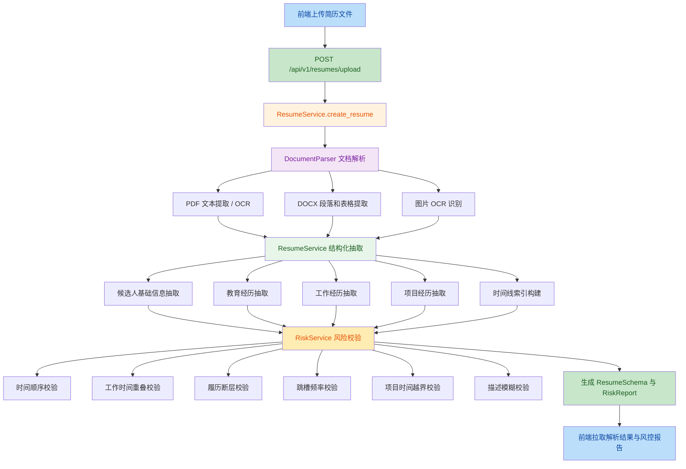
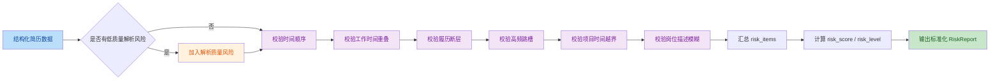
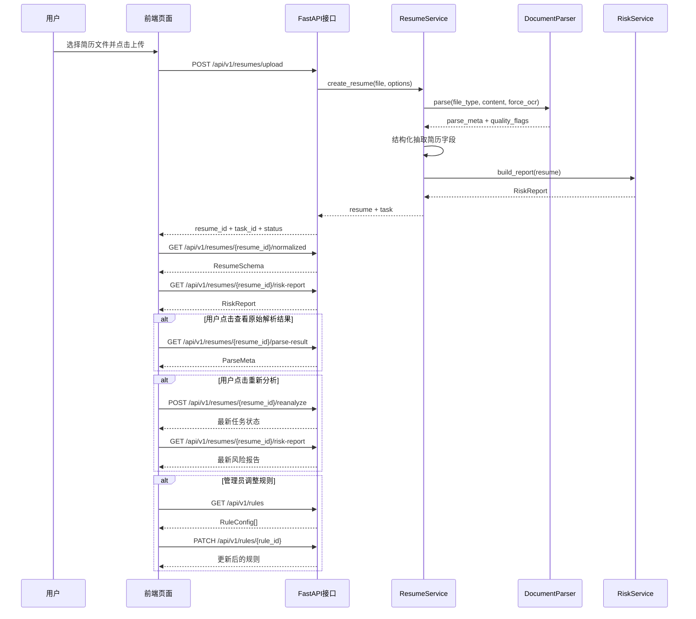

# 项目流程与前端需求梳理

## 1. 当前需求覆盖结论

结合当前项目实现，需求覆盖情况如下：

| 需求项 | 当前状态 | 说明 |
| --- | --- | --- |
| 1. 支持多格式简历结构化提取 | 已实现 | 已支持 `PDF / DOCX / DOC / JPG / JPEG / PNG`，PDF 走文本提取，必要时回退 OCR，DOCX 支持段落和表格提取，图片走 OCR。 |
| 2. 校验学历、工作经历时间线逻辑，识别前后矛盾、时间重叠 | 基本实现 | 已实现开始时间晚于结束时间、工作经历时间重叠、项目时间超出所属工作时间等规则。学历时间本身也会参与开始/结束时间顺序校验。 |
| 3. 自动识别履历断层、岗位描述模糊 / 夸大 / 造假等风险点 | 部分实现 | 已实现履历断层识别、岗位描述模糊识别；“夸大 / 造假”目前主要通过时间矛盾、项目越界、描述模糊等间接识别，还没有做独立的强校验模型。 |
| 4. 统计跳槽频率，识别高频跳槽等稳定性风险并预警 | 已实现 | 已支持近 3 年跳槽次数过多、平均任职时长过短两类稳定性风险。 |
| 5. 生成标准化校验报告、风险点清单与异常预警说明 | 已实现 | 已输出标准化 `RiskReport`，包含 `risk_score`、`risk_level`、`risk_items`、`summary`，可直接供前端展示。 |

## 2. 当前系统能力边界

- 当前后端主体已经具备“上传简历 -> 解析结构化数据 -> 运行风控规则 -> 返回风险报告”的完整链路。
- 当前仓库内没有现成前端工程，现阶段是 API 服务形态，适合前端单独接入。
- 当前存储仍然是内存态，适合本地演示和单机调试，不适合生产环境长时间保存任务和结果。
- `.doc` 旧格式目前仍是兜底文本解析，建议优先转 `.docx`。
- 对“夸大 / 造假”的识别还没有接入更强的规则引擎或 LLM 复核能力，因此现阶段更适合定位“可验证风险”和“疑似异常点”。

## 3. 系统主流程



## 4. 风控规则流程



## 5. 前后端交互时序图



### 5.1 交互说明

- 上传动作的主入口是 `POST /api/v1/resumes/upload`
- 当前接口是同步返回，所以前端在上传成功后，可以直接进入结果页拉取详情数据
- 若后续改造成异步队列模式，可以保留当前 `status` 接口，前端只需要把“上传成功直接跳结果页”改成“上传成功后轮询状态”
- “重新分析”适合作为结果页和风险报告页的操作按钮
- 规则配置页建议仅对管理员开放

## 6. 当前后端接口清单

### 6.1 全局说明

- 服务名称：`Resume Risk MVP`
- 当前版本：`0.1.0`
- API 前缀：`/api/v1`
- 文档入口：`/docs`
- 数据格式：
  - 普通接口默认使用 `application/json`
  - 简历上传接口使用 `multipart/form-data`
- 当前存储实现：
  - 简历、任务、风险报告、简历库均为内存态
  - 服务重启后数据不会保留

### 6.2 接口总览

| 模块 | 方法 | 路径 | 说明 |
| --- | --- | --- | --- |
| Root | `GET` | `/` | 获取服务基础信息 |
| Health | `GET` | `/api/v1/health` | 健康检查 |
| Resume | `POST` | `/api/v1/resumes/upload` | 上传简历并触发解析 |
| Resume | `GET` | `/api/v1/resumes/{resume_id}/status` | 查询解析任务状态 |
| Resume | `GET` | `/api/v1/resumes/{resume_id}/normalized` | 获取结构化简历 |
| Resume | `GET` | `/api/v1/resumes/{resume_id}/parse-result` | 获取原始解析结果 |
| Resume | `GET` | `/api/v1/resumes/{resume_id}/risk-report` | 获取风险报告 |
| Resume | `GET` | `/api/v1/resumes/{resume_id}/risk-report/download` | 获取风险报告下载地址 |
| Resume | `POST` | `/api/v1/resumes/{resume_id}/reanalyze` | 重新分析简历 |
| Rule | `GET` | `/api/v1/rules` | 获取规则列表 |
| Rule | `POST` | `/api/v1/rules/validate` | 校验单条规则 |
| Rule | `PATCH` | `/api/v1/rules/{rule_id}` | 更新规则配置 |
| Talent | `POST` | `/api/v1/resume-library/import` | 保存简历到简历库 |
| Talent | `GET` | `/api/v1/resume-library` | 查询简历库 |
| Talent | `GET` | `/api/v1/resume-library/{library_id}` | 获取简历库详情 |
| Talent | `POST` | `/api/v1/job-matching/match` | 基于 JD 匹配简历 |
| Talent | `POST` | `/api/v1/interview-questions/recommend` | 基于简历推荐面试题 |

### 6.3 Root 与健康检查

#### 6.3.1 `GET /`

**用途**

- 获取服务名称、版本和文档入口

**请求参数**

- 无

**响应示例**

```json
{
  "name": "Resume Risk MVP",
  "version": "0.1.0",
  "docs": "/docs"
}
```

#### 6.3.2 `GET /api/v1/health`

**用途**

- 检查服务可用性

**请求参数**

- 无

**响应字段**

- `status`: 服务状态
- `services`: 依赖服务状态映射
- `time`: 检查时间

**响应示例**

```json
{
  "status": "ok",
  "services": {
    "db": "stub",
    "redis": "stub",
    "storage": "stub"
  },
  "time": "2026-07-06T10:00:00Z"
}
```

### 6.4 简历解析相关接口

#### 6.4.1 `POST /api/v1/resumes/upload`

**用途**

- 上传 PDF / Word / 图片简历并立即触发解析

**请求类型**

- `multipart/form-data`

**表单字段**

- `file`: 必填，简历文件
- `async`: 可选，布尔值，当前实现中会被忽略
- `candidate_id`: 可选，当前实现中会被忽略
- `options`: 可选，JSON 字符串，目前主要支持：
  - `force_ocr: boolean`

**请求示例**

```text
file=<binary>
options={"force_ocr": true}
```

**响应字段**

- `resume_id`: 简历标识
- `task_id`: 任务标识
- `status`: 任务状态
- `file_name`: 文件名
- `file_type`: 文件类型
- `created_at`: 创建时间

**响应示例**

```json
{
  "resume_id": "res_fd11f143737d",
  "task_id": "task_6f1e8dc4b1a2",
  "status": "done",
  "file_name": "周子轩_JAVA开发工程师.docx",
  "file_type": "docx",
  "created_at": "2026-07-06T10:00:00Z"
}
```

**错误说明**

- `400`: 文件类型不支持
- `400`: `options` 不是合法 JSON

#### 6.4.2 `GET /api/v1/resumes/{resume_id}/status`

**用途**

- 查询简历任务状态

**路径参数**

- `resume_id`: 简历标识

**响应字段**

- `resume_id`
- `task_id`
- `status`
- `progress`
- `current_stage`
- `created_at`
- `updated_at`

**错误说明**

- `404`: 简历不存在

#### 6.4.3 `GET /api/v1/resumes/{resume_id}/normalized`

**用途**

- 获取结构化简历结果

**路径参数**

- `resume_id`: 简历标识

**主要响应字段**

- `resume_id`
- `source`
- `parse_meta`
- `candidate`
- `education`
- `work_experience`
- `project_experience`
- `skills`
- `certificates`
- `languages`
- `self_evaluation`
- `timeline_index`
- `quality_flags`

**错误说明**

- `404`: 简历不存在

#### 6.4.4 `GET /api/v1/resumes/{resume_id}/parse-result`

**用途**

- 获取原始解析结果

**路径参数**

- `resume_id`: 简历标识

**主要响应字段**

- `parser_chain`
- `parse_confidence`
- `ocr_used`
- `layout_used`
- `raw_text`
- `raw_blocks`

**错误说明**

- `404`: 简历不存在

#### 6.4.5 `GET /api/v1/resumes/{resume_id}/risk-report`

**用途**

- 获取标准化风险报告

**路径参数**

- `resume_id`: 简历标识

**主要响应字段**

- `report_id`
- `resume_id`
- `risk_score`
- `risk_level`
- `risk_items`
- `summary`
- `generated_at`

**`risk_items[]` 关键字段**

- `rule_id`
- `rule_name`
- `category`
- `severity`
- `score_impact`
- `description`
- `evidence`
- `suggestion`

**错误说明**

- `404`: 风险报告不存在

#### 6.4.6 `GET /api/v1/resumes/{resume_id}/risk-report/download`

**用途**

- 获取风险报告下载地址

**路径参数**

- `resume_id`: 简历标识

**查询参数**

- `format`: 可选，默认 `pdf`
  - 支持值：`pdf`、`html`、`json`

**响应字段**

- `resume_id`
- `format`
- `download_url`

**错误说明**

- `400`: 下载格式不支持
- `404`: 下载地址不存在

#### 6.4.7 `POST /api/v1/resumes/{resume_id}/reanalyze`

**用途**

- 基于当前已保存简历重新执行风险分析

**路径参数**

- `resume_id`: 简历标识

**请求体**

```json
{
  "force_ocr": false,
  "rule_profile": "default",
  "use_llm_review": false
}
```

**说明**

- 当前实现中，请求体已定义但实际未生效，接口行为等价于“重新生成风险报告”

**响应字段**

- 与任务状态接口一致

**错误说明**

- `404`: 简历不存在

### 6.5 规则管理相关接口

#### 6.5.1 `GET /api/v1/rules`

**用途**

- 查询规则列表

**查询参数**

- `category`: 可选，规则类别
- `enabled`: 可选，是否启用
- `severity`: 可选，风险等级

**响应字段**

- `rule_id`
- `rule_name`
- `category`
- `severity`
- `enabled`
- `score_impact`
- `thresholds`
- `description`

#### 6.5.2 `POST /api/v1/rules/validate`

**用途**

- 用一份简历数据试跑单条规则，判断是否命中

**请求体**

```json
{
  "rule_id": "R1_001",
  "resume": {}
}
```

**请求字段**

- `rule_id`: 规则 ID
- `resume`: 简历对象，使用结构化简历 JSON

**响应字段**

- `rule_id`
- `hit`
- `severity`
- `score_impact`
- `description`

**错误说明**

- `404`: 规则不存在

#### 6.5.3 `PATCH /api/v1/rules/{rule_id}`

**用途**

- 更新规则启用状态、阈值和扣分配置

**路径参数**

- `rule_id`: 规则 ID

**请求体**

```json
{
  "enabled": true,
  "thresholds": {
    "gap_months": 4
  },
  "score_impact": -8
}
```

**请求字段**

- `enabled`: 可选，是否启用
- `thresholds`: 可选，阈值配置
- `score_impact`: 可选，分值影响

**响应字段**

- 返回更新后的完整 `RuleConfig`

**错误说明**

- `404`: 规则不存在

### 6.6 人才库与匹配相关接口

#### 6.6.1 `POST /api/v1/resume-library/import`

**用途**

- 将已解析简历保存到简历库

**请求体**

```json
{
  "resume_id": "res_fd11f143737d",
  "tags": ["Java", "后端"],
  "source_label": "校园招聘"
}
```

**请求字段**

- `resume_id`: 必填，已解析简历 ID
- `tags`: 可选，标签列表
- `source_label`: 可选，来源标签

**响应字段**

- `library_id`
- `resume_id`
- `candidate_name`
- `current_title`
- `current_city`
- `highest_degree`
- `total_work_years`
- `skills`
- `tags`
- `source_label`
- `risk_score`
- `risk_level`
- `created_at`
- `updated_at`
- `resume`
- `risk_report`

**错误说明**

- `404`: 简历不存在

#### 6.6.2 `GET /api/v1/resume-library`

**用途**

- 查询简历库列表

**查询参数**

- `keyword`: 可选，关键词
- `risk_level`: 可选，风险等级
- `min_risk_score`: 可选，最小风险分
- `tag`: 可选，标签

**响应字段**

- 返回 `ResumeLibraryListItem[]`
- 单条记录主要字段：
  - `library_id`
  - `resume_id`
  - `candidate_name`
  - `current_title`
  - `current_city`
  - `highest_degree`
  - `total_work_years`
  - `skills`
  - `tags`
  - `risk_score`
  - `risk_level`
  - `created_at`
  - `updated_at`

#### 6.6.3 `GET /api/v1/resume-library/{library_id}`

**用途**

- 获取简历库中的单份候选人详情

**路径参数**

- `library_id`: 简历库记录 ID

**响应字段**

- 返回完整 `ResumeLibraryRecord`
- 包含列表信息、完整 `resume` 和完整 `risk_report`

**错误说明**

- `404`: 简历库记录不存在

#### 6.6.4 `POST /api/v1/job-matching/match`

**用途**

- 基于职位描述从简历库中筛选候选人

**请求体**

```json
{
  "job_title": "Java开发工程师",
  "job_description": "负责 Java 后端开发，熟悉 Spring Boot、MySQL、Redis，具备 3 年以上开发经验。",
  "required_skills": ["Java", "Spring", "MySQL", "Redis"],
  "preferred_skills": ["Kafka"],
  "keywords": ["后端开发"],
  "min_years": 3,
  "degree_requirement": "本科",
  "max_results": 10,
  "min_score": 0
}
```

**请求字段**

- `job_title`: 可选，职位名称
- `job_description`: 可选，职位描述正文
- `required_skills`: 可选，必备技能
- `preferred_skills`: 可选，加分技能
- `keywords`: 可选，补充关键词
- `min_years`: 可选，最小工作年限
- `degree_requirement`: 可选，最低学历要求
- `max_results`: 可选，最多返回数量，默认 `10`
- `min_score`: 可选，最小匹配分，默认 `0`

**响应字段**

- `total_candidates_scanned`
- `matched_count`
- `items`

**`items[]` 关键字段**

- `library_id`
- `resume_id`
- `candidate_name`
- `current_title`
- `match_score`
- `matched_skills`
- `missing_skills`
- `matched_keywords`
- `missing_keywords`
- `reasons`
- `risk_score`
- `risk_level`

#### 6.6.5 `POST /api/v1/interview-questions/recommend`

**用途**

- 基于简历或简历库记录生成面试题

**请求体**

```json
{
  "resume_id": "res_fd11f143737d",
  "library_id": null,
  "question_count": 10,
  "include_risk_questions": true
}
```

**请求字段**

- `resume_id`: 可选，简历 ID
- `library_id`: 可选，简历库记录 ID
- `question_count`: 可选，题目数量，范围 `1-30`
- `include_risk_questions`: 可选，是否包含风险核验题

**约束说明**

- `resume_id` 和 `library_id` 至少传一个

**响应字段**

- `resume_id`
- `library_id`
- `candidate_name`
- `items`

**`items[]` 关键字段**

- `question_id`
- `category`
- `difficulty`
- `question`
- `rationale`
- `related_resume_fields`
- `expected_signals`

### 6.7 通用错误说明

- `400 Bad Request`
  - 请求参数不合法
  - 文件类型不支持
  - JSON 格式错误
  - 下载格式不支持
- `404 Not Found`
  - `resume_id`、`library_id`、`rule_id` 不存在
- `422 Unprocessable Entity`
  - 请求体字段校验失败
  - 例如面试题推荐接口同时未传 `resume_id` 和 `library_id`

## 7. 前端页面建议

如果要把这个系统做成一个完整前端页面，建议最少拆成以下 8 个页面 / 模块。

### 7.1 页面一：简历上传页

**页面目标**

- 上传 PDF / Word / 图片简历
- 配置解析选项
- 发起解析任务

**页面模块**

- 文件上传区
- 文件格式说明
- OCR 开关配置
- 上传进度 / 提交状态提示
- 最近上传记录入口

**核心字段**

- 文件名
- 文件类型
- 文件大小
- `force_ocr`

**依赖接口**

- `POST /api/v1/resumes/upload`

**前端交互建议**

- 拖拽上传 + 点击上传双模式
- 上传前校验文件格式
- 上传后拿到 `resume_id`、`task_id`
- 自动跳转到“解析结果总览页”

### 7.2 页面二：解析结果总览页

**页面目标**

- 展示本次解析是否成功
- 汇总展示解析质量、风险等级、主要风险点
- 作为后续详情页的导航入口

**页面模块**

- 基础信息卡片
- 解析质量卡片
- 风险评分卡片
- 主要风险摘要
- 结果操作区

**核心字段**

- `resume_id`
- `source.file_name`
- `source.file_type`
- `source.pages`
- `parse_meta.parse_confidence`
- `parse_meta.ocr_used`
- `quality_flags`
- `risk_score`
- `risk_level`
- `summary.major_findings`

**依赖接口**

- `GET /api/v1/resumes/{resume_id}/normalized`
- `GET /api/v1/resumes/{resume_id}/risk-report`
- 可选 `GET /api/v1/resumes/{resume_id}/status`

**前端交互建议**

- 用颜色区分 `low / medium / high`
- 支持“重新分析”
- 支持“下载报告”

### 7.3 页面三：结构化简历详情页

**页面目标**

- 展示从原始简历中抽取出的结构化信息
- 让业务人员快速核对解析准确性

**页面模块**

- 候选人基础信息
- 教育经历列表
- 工作经历列表
- 项目经历列表
- 自我评价
- 原始解析文本预览

**核心字段**

- `candidate.name / phone / email / current_city / highest_degree / total_work_years`
- `education[]`
- `work_experience[]`
- `project_experience[]`
- `self_evaluation`
- `parse_meta.raw_text`

**依赖接口**

- `GET /api/v1/resumes/{resume_id}/normalized`
- 可选 `GET /api/v1/resumes/{resume_id}/parse-result`

**前端交互建议**

- 列表卡片形式展示教育 / 工作 / 项目
- 每个字段旁边显示 `confidence`
- 支持“原文对照查看”

### 7.4 页面四：风险报告页

**页面目标**

- 展示每条风险规则的命中情况
- 给出风险解释、证据、建议

**页面模块**

- 风险总分与风险等级
- 风险条目列表
- 异常证据面板
- 处理建议区
- 时间线异常可视化

**核心字段**

- `risk_score`
- `risk_level`
- `risk_items[].rule_id`
- `risk_items[].rule_name`
- `risk_items[].severity`
- `risk_items[].description`
- `risk_items[].evidence`
- `risk_items[].suggestion`

**依赖接口**

- `GET /api/v1/resumes/{resume_id}/risk-report`
- 可结合 `GET /api/v1/resumes/{resume_id}/normalized`

**前端交互建议**

- 风险按严重程度分组
- 时间线类风险建议结合时间轴组件展示
- 支持“仅看高风险”“仅看时间线问题”“仅看稳定性问题”筛选

### 7.5 页面五：规则配置页

**页面目标**

- 管理员查看和调整规则参数
- 支持阈值调优

**页面模块**

- 规则列表
- 分类筛选
- 启用 / 停用开关
- 阈值编辑
- 分值编辑

**核心字段**

- `rule_id`
- `rule_name`
- `category`
- `severity`
- `enabled`
- `score_impact`
- `thresholds`
- `description`

**依赖接口**

- `GET /api/v1/rules`
- `PATCH /api/v1/rules/{rule_id}`
- 可选 `POST /api/v1/rules/validate`

**前端交互建议**

- 允许按 `timeline / continuity / stability / description / quality` 分类筛选
- 调整后支持即时保存
- 提供“恢复默认阈值”能力

### 7.6 页面六：简历库列表页

**页面目标**

- 统一查看已入库简历
- 支持按关键词、风险、标签做筛选
- 支持进入简历详情和匹配流程

**页面模块**

- 检索筛选栏
- 简历库列表
- 风险标签和技能标签
- 快捷操作区

**核心字段**

- `library_id`
- `candidate_name`
- `current_title`
- `current_city`
- `highest_degree`
- `total_work_years`
- `skills`
- `risk_score`
- `risk_level`
- `tags`

**依赖接口**

- `GET /api/v1/resume-library`
- `GET /api/v1/resume-library/{library_id}`

### 7.7 页面七：JD 匹配页

**页面目标**

- 输入职位描述筛选简历库
- 输出匹配排序结果和命中理由

**页面模块**

- JD 输入区
- 结构化筛选区
- 匹配结果列表
- 匹配解释区

**核心字段**

- `job_title`
- `job_description`
- `required_skills`
- `preferred_skills`
- `min_years`
- `degree_requirement`
- `match_score`
- `matched_skills`
- `missing_skills`
- `matched_keywords`
- `missing_keywords`

**依赖接口**

- `POST /api/v1/job-matching/match`

### 7.8 页面八：面试题推荐页

**页面目标**

- 基于候选人简历自动生成面试题
- 支持区分技能核验、项目深挖、风险核验题

**页面模块**

- 候选人摘要区
- 题目分类区
- 题目卡片区
- 导出 / 复制区

**核心字段**

- `resume_id`
- `library_id`
- `candidate_name`
- `items[].category`
- `items[].difficulty`
- `items[].question`
- `items[].rationale`
- `items[].expected_signals`

**依赖接口**

- `POST /api/v1/interview-questions/recommend`

## 8. 前端页面原型说明

以下内容用于直接指导前端页面原型设计，细化到区域、组件和字段展示。

### 8.1 简历上传页原型说明

**页面结构**

- 顶部区域：页面标题、功能简介、支持文件格式说明
- 中间主区域：上传组件、参数配置区、上传按钮
- 下方区域：上传须知、最近上传记录入口
- 右侧辅助区域：功能说明卡片、解析能力说明

**区域拆解**

1. 顶部标题区
   - 组件：`PageHeader`
   - 展示内容：
     - 主标题：`简历解析与风险校验`
     - 副标题：`支持 PDF / Word / 图片，多维度输出结构化简历与风险报告`

2. 文件上传区
   - 组件：拖拽上传框 `Upload.Dragger`
   - 展示内容：
     - 上传图标
     - 提示文案：`拖拽简历到此处，或点击上传`
     - 文件格式提示：`支持 pdf/docx/doc/jpg/jpeg/png`
     - 文件大小提示：可由前端自行定义限制文案

3. 参数配置区
   - 组件：表单 `Form`
   - 字段：
     - `force_ocr`：开关组件 `Switch`
   - 说明文案：
     - `当简历为扫描件或文本提取不完整时，建议开启 OCR`

4. 操作按钮区
   - 组件：主按钮 + 次按钮
   - 按钮：
     - `开始解析`
     - `重置`

5. 上传结果反馈区
   - 组件：消息提示 `Alert` / `Message`
   - 展示字段：
     - `file_name`
     - `file_type`
     - 上传成功 / 失败提示

**页面需要展示的字段**

- 本地文件名
- 文件扩展名
- `force_ocr`
- 上传返回后的 `resume_id`
- 上传返回后的 `task_id`

### 8.2 解析结果总览页原型说明

**页面结构**

- 顶部区域：候选人摘要 + 操作按钮
- 中间区域：解析质量卡片、风险评分卡片、主要风险摘要
- 下方区域：跳转入口卡片
- 右侧区域：文件信息与处理信息

**区域拆解**

1. 顶部摘要区
   - 组件：`PageHeader + Tag + ButtonGroup`
   - 展示字段：
     - `candidate.name.value`
     - `source.file_name`
     - `source.file_type`
     - `source.upload_time`
   - 操作按钮：
     - `查看结构化详情`
     - `查看风险报告`
     - `重新分析`
     - `下载报告`

2. 风险评分卡片区
   - 组件：统计卡片 `StatisticCard`
   - 展示字段：
     - `risk_score`
     - `risk_level`
   - 建议展示方式：
     - 分数仪表盘
     - 风险等级颜色标签

3. 解析质量卡片区
   - 组件：信息卡片 + 状态标签
   - 展示字段：
     - `parse_meta.parse_confidence`
     - `parse_meta.ocr_used`
     - `source.pages`
     - `quality_flags`

4. 主要风险摘要区
   - 组件：列表 `List`
   - 展示字段：
     - `summary.major_findings`

5. 快捷入口区
   - 组件：导航卡片 `Card`
   - 入口：
     - `结构化简历详情`
     - `风险报告详情`
     - `原始解析文本`

### 8.3 结构化简历详情页原型说明

**页面结构**

- 顶部区域：候选人基础信息卡
- 中间区域：教育 / 工作 / 项目三个 Tab
- 下方区域：自我评价和原始解析文本
- 右侧区域：解析置信度辅助面板

**区域拆解**

1. 候选人基础信息卡
   - 组件：描述列表 `Descriptions`
   - 展示字段：
     - `candidate.name.value`
     - `candidate.phone.value`
     - `candidate.email.value`
     - `candidate.current_city.value`
     - `candidate.highest_degree.value`
     - `candidate.total_work_years.value`

2. 教育经历区
   - 组件：卡片列表 / 时间轴
   - 每条展示字段：
     - `school_name.value`
     - `degree.value`
     - `major.value`
     - `start_date.value`
     - `end_date.value`
     - `description.value`

3. 工作经历区
   - 组件：经历卡片 `Timeline + Card`
   - 每条展示字段：
     - `company_name.value`
     - `title.value`
     - `employment_type`
     - `start_date.value`
     - `end_date.value`
     - `duration_months.value`
     - `description.value`

4. 项目经历区
   - 组件：项目卡片列表
   - 每条展示字段：
     - `project_name.value`
     - `role.value`
     - `start_date.value`
     - `end_date.value`
     - `description.value`

5. 自我评价区
   - 组件：文本卡片
   - 展示字段：
     - `self_evaluation.text`

6. 原始解析文本区
   - 组件：代码块 / 文本预览组件
   - 展示字段：
     - `parse_meta.raw_text`

7. 置信度辅助区
   - 组件：标签 / 进度条
   - 展示字段：
     - 各字段 `confidence`
   - 交互建议：
     - 低于阈值的字段高亮

### 8.4 风险报告页原型说明

**页面结构**

- 顶部区域：总风险概览
- 中间左侧：风险条目列表
- 中间右侧：证据与建议面板
- 下方区域：时间线可视化

**区域拆解**

1. 总风险概览区
   - 组件：统计卡 + 风险等级徽标
   - 展示字段：
     - `risk_score`
     - `risk_level`
     - `summary.major_findings`

2. 风险条目列表区
   - 组件：可折叠列表 `Collapse`
   - 每条展示字段：
     - `rule_id`
     - `rule_name`
     - `severity`
     - `description`
     - `score_impact`

3. 风险证据区
   - 组件：证据表格 / JSON 面板
   - 展示字段：
     - `risk_items[].evidence`

4. 处理建议区
   - 组件：提示框 `Alert`
   - 展示字段：
     - `risk_items[].suggestion`

5. 时间线可视化区
   - 组件：时间轴 / 甘特风格展示
   - 数据来源：
     - `timeline_index`
     - `risk_items` 中的时间线证据

6. 筛选工具栏
   - 组件：筛选器 `Select + Tabs + Tag`
   - 筛选维度：
     - 按严重程度
     - 按规则分类
     - 按是否命中

### 8.5 规则配置页原型说明

**页面结构**

- 顶部区域：页面标题和规则说明
- 中间区域：规则筛选栏 + 规则表格
- 右侧抽屉：规则编辑面板

**区域拆解**

1. 筛选栏
   - 组件：查询表单
   - 筛选字段：
     - `category`
     - `severity`
     - `enabled`

2. 规则表格区
   - 组件：表格 `Table`
   - 列字段：
     - `rule_id`
     - `rule_name`
     - `category`
     - `severity`
     - `enabled`
     - `score_impact`
     - `description`
     - `thresholds`

3. 规则编辑抽屉
   - 组件：抽屉 `Drawer + Form`
   - 可编辑字段：
     - `enabled`
     - `score_impact`
     - `thresholds`

4. 验证区
   - 组件：按钮 + 结果提示
   - 功能：
     - 调用 `POST /api/v1/rules/validate`
     - 快速验证单条规则效果

### 8.6 简历库列表页原型说明

**页面结构**

- 顶部区域：搜索栏与筛选条件
- 中间区域：候选人列表
- 右侧区域：候选人快捷预览

**区域拆解**

1. 搜索筛选区
   - 组件：查询表单 `Form`
   - 字段：
     - `keyword`
     - `risk_level`
     - `min_risk_score`
     - `tag`

2. 简历列表区
   - 组件：表格或卡片列表
   - 列字段：
     - `candidate_name`
     - `current_title`
     - `current_city`
     - `highest_degree`
     - `total_work_years`
     - `risk_score`
     - `risk_level`
     - `skills`

3. 快捷操作区
   - 组件：按钮组
   - 动作：
     - 查看详情
     - 发起匹配
     - 生成面试题

### 8.7 JD 匹配页原型说明

**页面结构**

- 左侧区域：JD 输入与结构化条件
- 右侧区域：匹配结果列表与匹配解释

**区域拆解**

1. JD 输入区
   - 组件：文本域 `Textarea`
   - 字段：
     - `job_title`
     - `job_description`

2. 结构化筛选区
   - 组件：表单 `Form`
   - 字段：
     - `required_skills`
     - `preferred_skills`
     - `min_years`
     - `degree_requirement`
     - `min_score`

3. 匹配结果区
   - 组件：表格 / 卡片列表
   - 展示字段：
     - `candidate_name`
     - `current_title`
     - `match_score`
     - `matched_skills`
     - `missing_skills`
     - `matched_keywords`
     - `risk_level`

4. 匹配解释区
   - 组件：折叠面板 `Collapse`
   - 展示字段：
     - `reasons`

### 8.8 面试题推荐页原型说明

**页面结构**

- 顶部区域：候选人摘要
- 中间区域：题目分类标签和题目列表
- 右侧区域：导出与复制操作

**区域拆解**

1. 候选人摘要区
   - 组件：信息卡片
   - 展示字段：
     - `candidate_name`
     - `current_title`
     - `risk_level`
     - `risk_score`

2. 题目列表区
   - 组件：题目卡片列表
   - 展示字段：
     - `category`
     - `difficulty`
     - `question`
     - `rationale`
     - `expected_signals`

3. 操作区
   - 组件：按钮组
   - 动作：
     - 重新生成
     - 复制全部
     - 导出为文本

### 8.9 页面级通用布局建议

**公共顶部导航**

- Logo
- 系统名称
- 菜单项：
  - `上传简历`
  - `解析结果`
  - `风险报告`
  - `简历库`
  - `JD 匹配`
  - `面试题推荐`
  - `规则配置`

**公共筛选与操作区**

- 返回按钮
- 刷新按钮
- 导出按钮
- 重新分析按钮

**公共状态呈现方式**

- `low`：绿色
- `medium`：橙色
- `high`：红色
- `critical`：深红色

## 9. 前端页面之间的跳转关系

建议页面关系如下：

1. 上传页
2. 解析结果总览页
3. 从总览页进入“结构化简历详情页”
4. 从总览页进入“风险报告页”
5. 从总览页或详情页执行“加入简历库”
6. 从导航栏进入“简历库列表页”
7. 从“简历库列表页”进入“JD 匹配页”
8. 从候选人详情或匹配结果进入“面试题推荐页”
9. 从导航栏进入“规则配置页”

## 10. 前端需要的核心展示组件

建议前端至少准备以下通用组件：

- 文件上传组件
- 状态标签组件
- 风险等级徽标组件
- 置信度展示组件
- 时间轴组件
- 表格 / 卡片混合列表组件
- JSON / 原文预览组件
- 风险证据折叠面板
- 报告下载按钮组件

## 11. 推荐前端数据结构使用方式

前端建议按以下思路组织数据：

- `uploadResult`: 上传接口返回，负责页面跳转和任务标识
- `resumeDetail`: 结构化简历详情
- `riskReport`: 风险报告详情
- `ruleList`: 规则配置列表
- `statusInfo`: 任务状态和进度
- `resumeLibraryList`: 简历库列表数据
- `jobMatchResult`: JD 匹配结果
- `interviewQuestions`: 面试题推荐结果

这样可以避免一个页面里混杂太多字段，页面职责更清晰。

## 12. 建议的产品展示文案

如果是做成业务侧页面，页面文案建议突出以下价值：

- 支持多格式简历自动解析
- 自动识别时间线异常与履历断层
- 自动预警高频跳槽与稳定性风险
- 输出标准化风险报告与异常说明
- 支持简历入库与职位匹配筛选
- 支持自动生成面试题与风险核验题
- 支持规则可配置与人工复核

## 13. 当前还建议补充的能力

为了让页面和产品更完整，后续建议继续补以下能力：

- 增加技能、证书、语言等字段的抽取和展示
- 将简历库从内存态升级为持久化存储
- 增加批量上传与批量报告导出
- 增加人工审核标记与复核结论回写
- 将 JD 匹配升级为向量召回 + 精排
- 将面试题推荐升级为 LLM 动态追问

## 14. 总结

当前项目已经可以支撑一个“简历解析 + 风险校验 + 标准化报告”的基础产品闭环：

- 后端主流程已经具备
- 核心规则已经具备
- 输出结构已经标准化
- 简历库、JD 匹配、面试题推荐能力已经具备 MVP 版本
- 前端可以围绕“上传、总览、详情、风险、简历库、匹配、题目推荐、规则配置”八类页面来承接

如果下一步要继续推进，最合适的动作是：

1. 先把简历库列表页、JD 匹配页和面试题推荐页补到前端
2. 用现有接口把上传、入库、匹配、推荐全链路串起来
3. 再补历史记录页、人工审核页和批量操作
4. 最后升级持久化存储、向量检索和 LLM 精排
